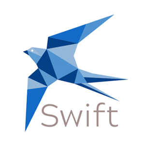

# Swift

<p align="center">
  
</p>

Meet Swift. Fast video meetings made simple.

Swift is a minimal, cross-platform web application for fast and simple video conferencing.

## Getting started

1. Clone this repo
```bash
git clone https://github.com/ajustinpatterson/Swift-Video-Meetings
```

2. Run npm install from the root and in the client and server folders
```bash
npm install
cd client && npm install
cd server && npm install
```

3. Start the development server
```bash
cd client/src && npm start
```

4. Create a `.env` file in the server folder with the following information:
```
PORT=
DB_NAME=
DB_USERNAME=
DB_PASSWORD=
```

For example:
```
PORT=3002
DB_NAME=swiftapp
DB_USERNAME=myusername
DB_PASSWORD=mypassword
```

5. Start the server
```bash
cd server && npm run dev
```

**Pssssst!**

The Swift server is hosted on Heroku.

[Heroku](http://fathomless-eyrie-92787.herokuapp.com/)

[GraphQL endpoint](http://fathomless-eyrie-92787.herokuapp.com/graphql)

## Built with
* [React](https://reactjs.org/)
* [Typescript](https://www.typescriptlang.org/)
* [Apollo Client/GraphQL](https://www.apollographql.com/)
* [PeerJS](https://peerjs.com/) - For peer to peer communication
* [Socket.io](https://socket.io/) - A Node.js library for realtime server and client communications
* [MediaDevices API](https://developer.mozilla.org/en-US/docs/Web/API/MediaDevices) - For screensharing, audio, and video functionalities
* [Sass](https://sass-lang.com/)
* [ExpressJS](https://expressjs.com/)
* [Apollo GraphQL](https://www.apollographql.com/docs/)
* [Sequelize ORM](https://sequelize.org/)
* [Docker](https://www.docker.com/) - Container management
* [Heroku](https://www.heroku.com/) - Server deployment
* [Cloudinary](https://cloudinary.com/) - Image management
* Powered by caffeine (and sometimes 🍷 🍻)

## Made by
* Andrea Disperati - [Github](https://github.com/Andrea-Dispe) - [LinkedIn](https://www.linkedin.com/in/andrea-dispe/) 🇮🇹 🇨🇳 🍝
* Justin Patterson - [Github](https://github.com/ajustinpatterson) - [LinkedIn](https://www.linkedin.com/in/ajustinpatterson/) 🇺🇸 🇪🇸 🍦
* Mo Wong - [Github](https://github.com/ommwong) - [LinkedIn](https://www.linkedin.com/in/mowong1) 🇺🇸 🇫🇷 🍜


